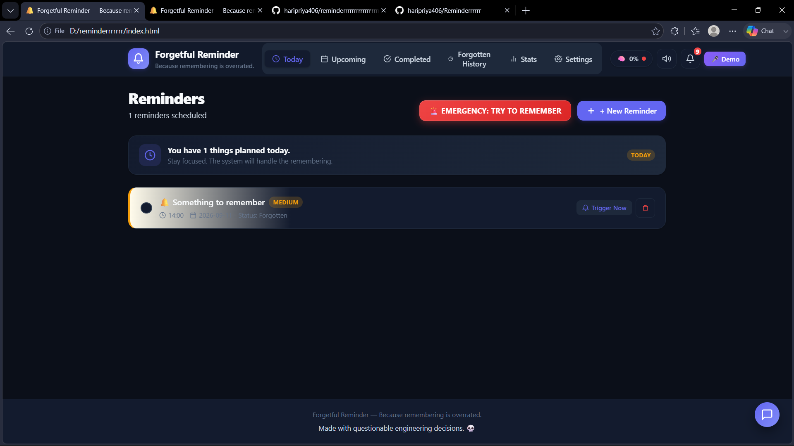
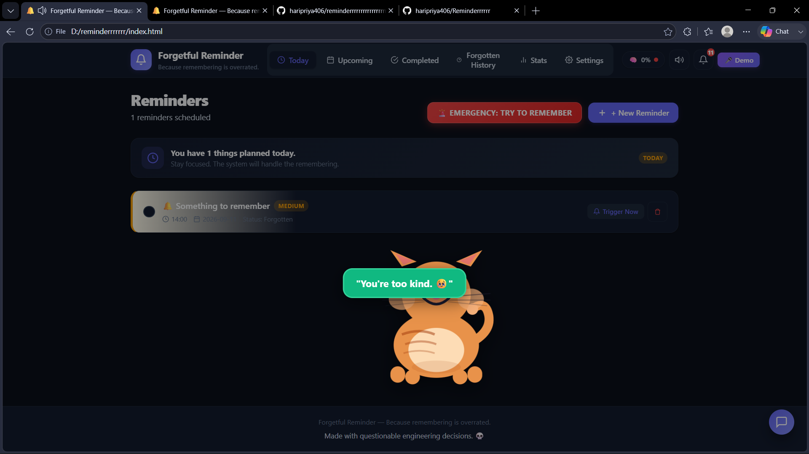
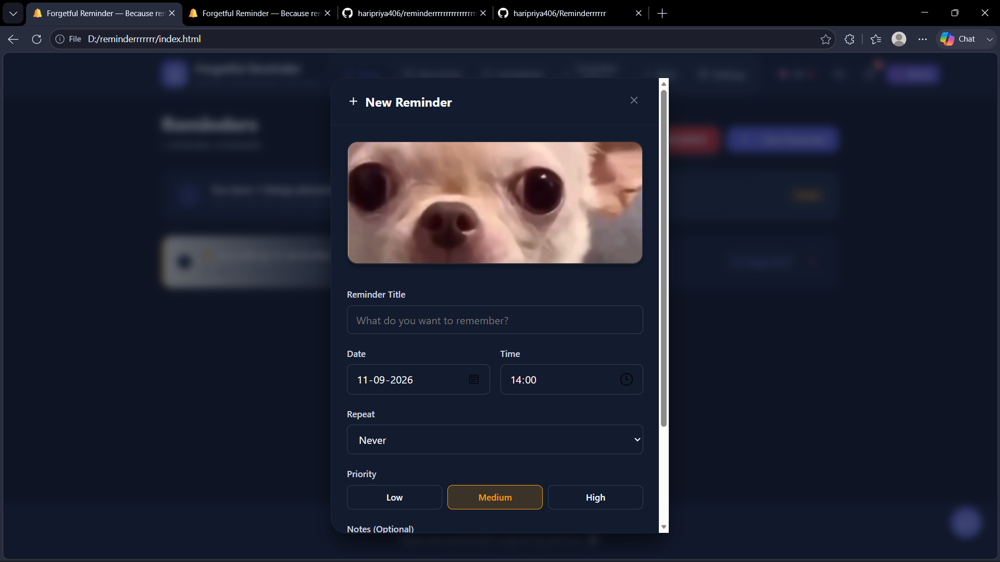
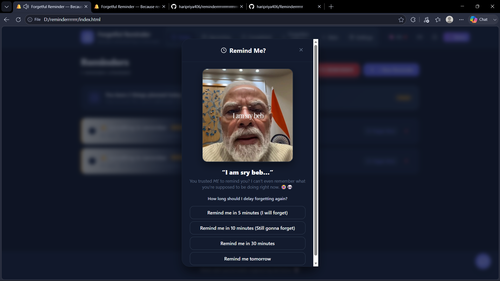
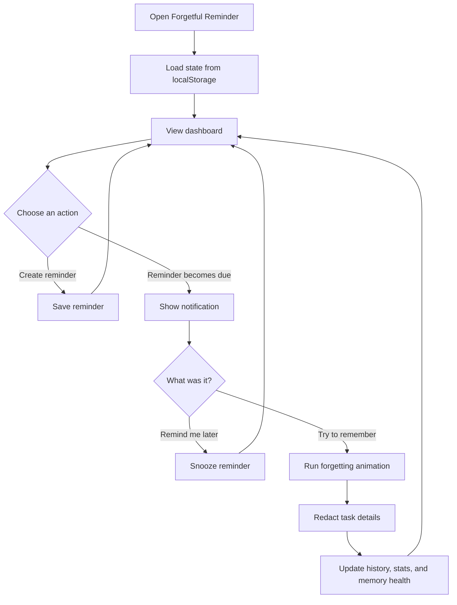
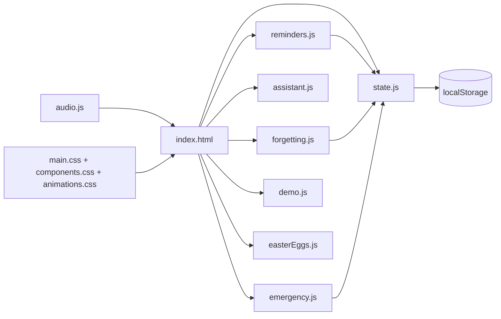

# 🔔 Forgetful Reminder 🎯

## Basic Details
### Team Name: NullSquad

### Team Members
- Team Lead: Haripriya - College of Engineering Karunagappaly
- Member 2: Akshaya - College of Engineering Karunagappaly

### Project Description
Forgetful Reminder is a polished reminder app with one important twist: when a reminder is due, the app forgets what it was supposed to say. It combines practical scheduling features with deliberately chaotic animations, sounds, statistics, and jokes.

### The Problem (that doesn't exist)
People are overwhelmed by reminder apps that insist on remembering every tiny responsibility. This creates the completely fictional problem of having too much productivity and not enough mystery.

### The Solution (that nobody asked for)
Forgetful Reminder schedules tasks, then dramatically loses the plot at exactly the wrong moment. Users get a realistic productivity dashboard, a forgetting engine, a fake memory assistant, and an emergency recovery scan that still cannot recover anything.

## Technical Details
### Technologies/Components Used
For Software:
- HTML5
- CSS3 with responsive layouts, themes, component styles, and animations
- Vanilla JavaScript with ES6 modules
- Web Audio API for procedural sound effects
- Browser `localStorage` for offline persistence
- SVG icons embedded in the interface
- Git and any modern web browser

For Hardware:
- No special hardware required
- Any laptop, desktop, or mobile device with a modern browser

### Implementation
For Software:

# Installation
No installation or package manager is required. Clone or download the repository:

```bash
git clone <repository-url>
cd reminderrrrrrr
```

# Run
On Windows, double-click `start.bat`, or open `index.html` directly in a browser.

## Project Documentation

### Screenshots

*The main reminder dashboard with scheduled tasks and quick actions.*


*The reminder experience as the app searches its extremely unreliable memory.*


*Memory and productivity statistics presented with appropriately questionable results.*


*Settings and controls for sound, themes, meme mode, and memory strength.*

### Diagrams


*Workflow from loading the app through scheduling, forgetting, and updating the dashboard.*


*Component architecture showing the browser UI, feature modules, shared state, persistence, and sound layer.*

## Project Demo
### Video
The included `assets/new_reminder_gif.mp4` demonstrates the reminder flow and the app's forgetting behavior.

### Additional Demos
- `assets/remind_me_meme.jpg` - snooze response artwork
- `assets/new_reminder_gif.mp4` - reminder creation and trigger demonstration

## Team Contributions
- Haripriya: Application structure, reminder workflow, dashboard, and documentation
- Akshaya: Forgetting experience, animations, audio interactions, and feature testing

---
Made with ❤️ at TinkerHub Useless Projects


